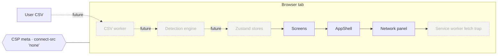

# Subliminate

A subscription audit tool that proves it isn't a backend. Drop a CSV from
your bank; Subliminate finds the recurring charges, surfaces price hikes,
and runs entirely in your browser tab. The Network Activity panel reads
zero, because zero is the truth.

> **Status:** Phase 7 of 8. Settings page with opt-in IndexedDB persistence (off by default), export to CSV/JSON, wipe, saved column mappings, and theme tri-toggle. ADR-0007 lays out the threat model. Phase 8 is the polish + deploy pass. See [CHANGELOG.md](CHANGELOG.md).

## Verify it in 30 seconds

1. `pnpm install && pnpm fetch-fonts && pnpm preview`
2. Open `http://localhost:4173` and DevTools → Network.
3. Click around: `/`, `/components`, `/upload`, `/privacy`, etc.
4. Count the requests that aren't to `localhost:4173` or `data:`. Count is zero.

The same flow runs as a Playwright test on every push: `pnpm test:e2e`
(see [tests/e2e/privacy.spec.ts](tests/e2e/privacy.spec.ts)). The
invariant is enforced, not aspirational. From Phase 6, the deployed bundle
also ships with a reproducible-build hash that you can verify against
your own local build.

## Why this exists

A subscription audit tool, by definition, reads the most sensitive ledger
in a person's life. The conventional shape — link your bank account to
our cloud — asks for trust we have no way to earn. Subliminate is a
demonstration that, in 2026, the entire job can run client-side. The
hosting is GitHub Pages. There is no server.

This is also a portfolio piece. The ADRs, the threat model, the CI
discipline, and the privacy invariant are first-class deliverables —
they're the point of the project, not afterthoughts.

## Architecture (Phase 1)



Dotted boxes ship in later phases. The Network panel and the CSP are
already live.

## Stack

- Vite + React 18 + TypeScript strict (`exactOptionalPropertyTypes` on)
- Tailwind v4 with `@theme` driven by canonical CSS variables
- React Router v6 for navigation
- Self-hosted webfonts (Geist, Source Serif 4, JetBrains Mono) via woff2
- Vitest + React Testing Library for unit tests
- Playwright for e2e — privacy invariant lives here

## Development

```bash
pnpm install
pnpm fetch-fonts   # downloads woff2 to public/fonts/ (one-time)
pnpm dev           # http://localhost:5173
```

Other scripts:

| Script             | What it does                                                      |
| ------------------ | ----------------------------------------------------------------- |
| `pnpm build`       | Production build via Vite                                         |
| `pnpm typecheck`   | `tsc -b --noEmit` against strict config                           |
| `pnpm lint`        | ESLint flat config                                                |
| `pnpm test`        | Vitest unit suite                                                 |
| `pnpm test:e2e`    | Playwright e2e (boots `vite preview` automatically)               |
| `pnpm test:privacy`| Just the privacy invariant — runs on every CI build               |
| `pnpm size`        | size-limit budget check                                           |

## Project structure

```
src/
  app/             # App, routes, theme provider
  components/
    primitives/    # Button, Chip, Seal, Logo, Money, Sparkline, Icon
    shell/         # AppShell, Sidebar, TopBar
    network/       # NetworkPanel
  screens/         # one folder per route
  styles/          # tokens.css, fonts.css, app.css
docs/
  adr/             # MADR architecture decision records
  mockup/          # original Claude Design output (reference only)
tests/
  unit/            # Vitest
  e2e/             # Playwright — privacy.spec.ts is load-bearing
```

## Roadmap

| Phase | Theme                                              | Tag    |
| ----- | -------------------------------------------------- | ------ |
| 1     | Scaffolding & design system                        | v0.1.0 ← shipped |
| 2     | CSV ingestion (Web Worker, column mapping)         | v0.2.0 ← shipped |
| 3     | Recurring-charge detection + Review screen         | v0.3.0 ← shipped |
| 4     | Dashboard                                          | v0.4.0 ← shipped |
| 5     | Subscription detail + Insights                     | v0.5.0 ← shipped |
| 6     | Privacy architecture: SW fetch trap, repro builds  | v0.6.0 ← shipped |
| 7     | Settings + ephemeral-first persistence             | v0.7.0 ← shipped |
| 8     | ADR pass, deploy, README polish                    | v1.0.0 |

## Non-goals

- Account linking (Plaid, Yodlee, Finicity). The friction of exporting a
  CSV is intentional — it makes the data flow legible.
- Backend, analytics, telemetry, accounts, sign-in
- ML-grade detection. Heuristics only, documented in ADR-0008.
- Mobile native, desktop binaries — the browser tab is the deliverable.

## ADRs

See [docs/adr/](docs/adr/README.md). ADRs that exist so far:

- [ADR-0001 — No backend](docs/adr/0001-no-backend.md)
- [ADR-0002 — CSV-only ingestion](docs/adr/0002-csv-only-ingestion.md)
- [ADR-0003 — CSP as primary invariant](docs/adr/0003-csp-as-primary-invariant.md)
- [ADR-0004 — Service-worker fetch trap](docs/adr/0004-service-worker-fetch-trap.md)
- [ADR-0005 — Reproducible builds &amp; bundle hashes](docs/adr/0005-reproducible-builds-and-bundle-hashes.md)
- [ADR-0006 — Self-hosted fonts](docs/adr/0006-self-hosted-fonts.md)
- [ADR-0007 — Ephemeral-by-default persistence](docs/adr/0007-ephemeral-by-default-persistence.md)
- [ADR-0008 — Recurring-charge detection heuristics](docs/adr/0008-recurring-charge-detection-heuristics.md)
- [ADR-0009 — Generic CSV mapper over bank presets](docs/adr/0009-generic-csv-mapper-over-bank-presets.md)
