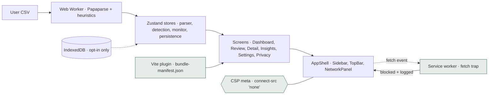

# Subliminate

A subscription audit tool that proves it isn't a backend. Drop a CSV from
your bank; Subliminate finds the recurring charges, surfaces price hikes,
and runs entirely in your browser tab. The Network Activity panel reads
zero, because zero is the truth.

> **Status:** v1.0.0. All eight phases shipped. Deployed at
> [nicksanft.github.io/Subliminate](https://nicksanft.github.io/Subliminate)
> (live once GitHub Pages is enabled on the repo).
> Source-of-record changelog: [CHANGELOG.md](CHANGELOG.md).

---

## 1. Verifying it in 30 seconds

The privacy claim is verifiable, not aspirational:

1. **Open the deployed app, DevTools → Network.** Use the upload flow
   end-to-end. Count the requests that aren't to the app's own origin
   or `data:`/`blob:`. The number is zero.
2. **Open the Privacy page.** The big counter at the top reads `0`. The
   number is incremented by the service-worker fetch trap; it has never
   been incremented in this session.
3. **Reproduce the build.** Clone the repo at the deployed commit, run
   `pnpm install && pnpm fetch-fonts && pnpm verify:repro`. Compare the
   `sha256` printed at the end to the digest rendered on the Privacy
   page. If they differ, the deployed bundle has been tampered with
   between the source and what your browser loaded.

The same flow runs on every push as [`tests/e2e/privacy.spec.ts`](tests/e2e/privacy.spec.ts).
CI fails if any of those three checks regresses.

## 2. Screenshots

The Claude Design reference shots live in [`docs/mockup/screenshots/`](docs/mockup/screenshots/).
The shipped UI follows them within minor spacing tolerance — see the
mockup folder for the full set across light and dark themes.

## 3. Architecture



Three trust mechanisms (highlighted in teal) work together:

- **CSP** stops cross-origin requests at the browser layer
  ([ADR-0003](docs/adr/0003-csp-as-primary-invariant.md)).
- **Service-worker fetch trap** logs and blocks any attempt, so the
  user can *see* the protection work
  ([ADR-0004](docs/adr/0004-service-worker-fetch-trap.md)).
- **Reproducible-build manifest** lets a reviewer match the deployed
  bundle byte-for-byte to a fresh local rebuild
  ([ADR-0005](docs/adr/0005-reproducible-builds-and-bundle-hashes.md)).

## 4. Detection algorithm

Six-stage pipeline. Reads transactions; emits scored subscriptions:

1. **Merchant normalization** — small rules table collapses unstable
   descriptions; everything else is title-cased after stripping
   POS/RECURRING/ZIP/dates/IDs.
2. **Clustering** — group by normalized merchant; require ≥3 charges.
3. **Cadence inference** — median delta in days, matched against
   weekly / monthly / quarterly / semi-annual / annual ranges, with a
   variance gate that rejects sparse clusters.
4. **Amount stability** — coefficient of variation; monotonic price
   hikes are tolerated.
5. **Price trajectory** — sustained step-changes ≥ $0.50 AND ≥ 5%.
6. **Confidence score** — 45 % cadence match + 30 % stability + 25 %
   charge-count factor, clamped to [0, 0.99], banded low/med/high.

CI enforces **≥ 95 % precision** on high-confidence detections and
**≥ 80 % recall** against the committed Chase fixture
(`tests/fixtures/chase_2024.csv`). Full rationale and alternatives:
[ADR-0008](docs/adr/0008-recurring-charge-detection-heuristics.md).

## 5. Project structure

```
src/
  app/             # App, routes, theme provider
  components/
    primitives/    # Button, Chip, Seal, Logo, Money, Sparkline, Switch, Modal, Icon
    shell/         # AppShell, Sidebar, TopBar
    network/       # NetworkPanel
    dashboard/     # StatCard, CategoryBar, RenewalsTimeline, Callout,
                   # PriceTrajectoryChart (Recharts), CadenceStrip
  screens/         # one folder per route
  lib/
    csv/           # Papaparse Web Worker + heuristics + types
    detection/     # normalize, cadence, stability, trajectory, confidence, detect
    categories/    # rules-table categorizer
    dashboard/     # callouts, renewals selectors
    insights/      # forgotten, top-N, YoY selectors
    network-monitor/ # SW client reducer + fallback
    persistence/   # idb wrapper + schema + export
  stores/          # parser, detection, monitor, persistence (Zustand)
  styles/          # tokens.css, fonts.css, app.css
docs/
  IMPLEMENTATION_PLAN.md   # the original brief
  adr/             # MADR-flavored architecture decision records
  mockup/          # Claude Design reference (read-only)
public/
  service-worker.js   # fetch trap (Phase 6)
  404.html            # SPA fallback for GitHub Pages
  fonts/              # self-hosted woff2 (fetched at install)
scripts/             # fetch-fonts, generate-fixtures, verify-repro, vite-plugin-bundle-manifest
tests/
  unit/            # Vitest — 175 tests
  e2e/             # Playwright — 36 tests including privacy.spec.ts
  fixtures/        # 4 bank-shaped CSVs (Chase 24mo, Amex, Apple Card, generic)
```

## 6. Development setup

```bash
pnpm install
pnpm fetch-fonts      # one-time, downloads self-hosted woff2
pnpm dev              # http://localhost:5173
```

Scripts:

| Script               | What it does                                                   |
| -------------------- | -------------------------------------------------------------- |
| `pnpm build`         | Production build (set `BASE=/Subliminate/` for Pages)           |
| `pnpm typecheck`     | `tsc -b --noEmit` against strict config                        |
| `pnpm lint`          | ESLint flat config                                             |
| `pnpm test`          | Vitest unit suite (175 tests)                                  |
| `pnpm test:e2e`      | Playwright e2e (36 tests; boots `vite preview` automatically)  |
| `pnpm test:privacy`  | Just the load-bearing privacy invariant                        |
| `pnpm size`          | size-limit check against six bucket budgets                    |
| `pnpm verify:repro`  | Build twice and assert bundle digests match                    |
| `pnpm fixtures:generate` | Re-derive the deterministic fixtures from the seed         |

## 7. Build verification

`pnpm verify:repro` builds twice with `SOURCE_DATE_EPOCH=0`. It exits
non-zero if the two `dist/bundle-manifest.json` digests differ. CI
runs the same command on every push.

To independently verify a deployed build matches its source:

```bash
git fetch --tags && git checkout v1.0.0
pnpm install --frozen-lockfile
pnpm fetch-fonts
BASE=/Subliminate/ pnpm build
jq -r .digest dist/bundle-manifest.json
```

Compare the printed digest to the value rendered on the deployed
`/privacy` page. They should match exactly. The deploy workflow
[`.github/workflows/deploy.yml`](.github/workflows/deploy.yml) does
this same check automatically after every Pages deploy.

## 8. Bundle budget

Six split budgets, enforced in CI via `pnpm size`:

| Asset                              | Brotli  | Budget |
| ---------------------------------- | ------- | ------ |
| Main bundle (initial load)         | 74.5 KB | 85 KB  |
| Recharts chunk (lazy)              | 86.3 KB | 100 KB |
| Subscription Detail chunk (lazy)   |  8.7 KB | 12 KB  |
| Insights chunk (lazy)              |  8.7 KB | 12 KB  |
| CSV parsing worker (lazy)          |  8.6 KB | 12 KB  |
| CSS                                |  3.8 KB |  6 KB  |

Recharts is lazy-loaded so the Dashboard / Review / Subscriptions /
Canceled / Privacy / Settings screens never download it. The CSV
parsing worker is loaded only when the user picks a file.

## 9. Architecture Decision Records

Each record is dated, numbered, and 1–3 minutes to read. The
[index](docs/adr/README.md) groups them by phase.

- [ADR-0001 — No backend](docs/adr/0001-no-backend.md) · *Phase 1*
- [ADR-0002 — CSV-only ingestion](docs/adr/0002-csv-only-ingestion.md) · *Phase 2*
- [ADR-0003 — CSP as primary invariant](docs/adr/0003-csp-as-primary-invariant.md) · *Phase 6*
- [ADR-0004 — Service-worker fetch trap](docs/adr/0004-service-worker-fetch-trap.md) · *Phase 6*
- [ADR-0005 — Reproducible builds and bundle hashes](docs/adr/0005-reproducible-builds-and-bundle-hashes.md) · *Phase 6*
- [ADR-0006 — Self-hosted fonts](docs/adr/0006-self-hosted-fonts.md) · *Phase 1*
- [ADR-0007 — Ephemeral-by-default persistence](docs/adr/0007-ephemeral-by-default-persistence.md) · *Phase 7*
- [ADR-0008 — Recurring-charge detection heuristics](docs/adr/0008-recurring-charge-detection-heuristics.md) · *Phase 3*
- [ADR-0009 — Generic CSV mapper over bank presets](docs/adr/0009-generic-csv-mapper-over-bank-presets.md) · *Phase 2*

## 10. Roadmap and non-goals

**Roadmap — shipped:**

| Phase | Theme                                              | Tag    |
| ----- | -------------------------------------------------- | ------ |
| 1     | Scaffolding & design system                        | v0.1.0 |
| 2     | CSV ingestion (Web Worker, column mapping)         | v0.2.0 |
| 3     | Recurring-charge detection + Review screen         | v0.3.0 |
| 4     | Dashboard                                          | v0.4.0 |
| 5     | Subscription detail + Insights                     | v0.5.0 |
| 6     | Privacy architecture: SW fetch trap, repro builds  | v0.6.0 |
| 7     | Settings + ephemeral-first persistence             | v0.7.0 |
| 8     | ADR pass, deploy, README polish                    | v1.0.0 |

**Non-goals — deliberately not shipping:**

- Account linking (Plaid / Yodlee / Finicity). The friction of
  exporting a CSV is the point. It makes the data flow legible.
- Backend, analytics, telemetry, accounts, sign-in. The whole project
  is the demonstration that none of those are necessary.
- ML-grade detection. Heuristics only, documented in ADR-0008.
- Mobile native / desktop binaries. The browser tab is the
  deliverable.

---

Licensed MIT. Third-party notices in [NOTICES.md](NOTICES.md).
